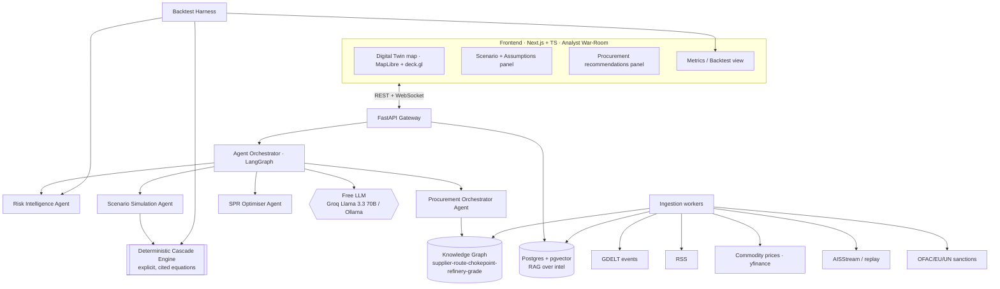

# URJA-SETU — AI-Driven Energy Supply Chain Resilience
### ET AI Hackathon 2.0 · Phase 2 (PoC / Build Sprint) · Master Plan

> **Problem Statement #2** — *AI-Driven Energy Supply Chain Resilience for Import-Dependent Economies*
> **Working product name:** URJA-SETU ("Energy Bridge") — provisional.
> **Team:** 2 (human lead = web-dev + pitch; AI = build).  **Budget:** ₹0 (strictly free/open-source).
> **Prize model:** single ₹10L pool shared across all 8 PS → **low-crowding PS + flawless, provable execution** is the strategy.
> **North star:** *Turn a geopolitical oil shock from a 47-day reactive scramble into a managed, hour-by-hour, evidence-backed response — provably, on open infrastructure.*

---

## 0. The one-paragraph thesis (what makes us win)
Most teams will build an "LLM dashboard" that *talks about* risk. We build a **closed loop**: live geopolitical/commodity signals → **deterministic** economic cascade simulation (transparent, testable assumptions) → **agentic** procurement rerouting (real refinery/grade/route data) → an analyst war-room digital twin — and we **prove** detection lead-time and accuracy with a **historical backtest**. The LLM is the *language and orchestration* layer; the *numbers* come from auditable models. That separation is exactly what the Evaluation Focus rewards and what 95% of teams will get wrong.

---

## 1. Requirement → Solution traceability (the rubric is the spec)

### 1a. "What You May Build" coverage
| PS module | We build | Depth |
|---|---|---|
| Geopolitical Risk Intelligence Agent | ✅ GDELT + sanctions + commodity → corridor/supplier risk score, **with citations** | **Hero** |
| Disruption Scenario Modeller | ✅ **Deterministic** cascade engine (Hormuz/Red Sea/OPEC+ cut) → supply gap, price, refinery run-rate, SPR cover | **Hero** |
| Adaptive Procurement Orchestrator | ✅ Agentic ranking over real suppliers/routes/grades | **Hero** |
| Supply Chain Digital Twin | ✅ MapLibre/deck.gl geospatial canvas (sources→chokepoints→ports→refineries→SPR) | **Showpiece** |
| Strategic Reserve Optimisation Agent | 🟡 SPR drawdown panel (lighter depth) | Should-have |

### 1b. Evaluation Focus → how we score on each (DO NOT SKIP)
| Evaluation Focus line | Our concrete answer |
|---|---|
| **Disruption signal detection lead time & accuracy** | **Backtest harness** over GDELT history vs a curated labeled-event set → reports **lead-time (days)** + **precision/recall**. Shown in a Metrics view. |
| **Quality & executability of procurement alternatives** | Recommendations grounded in real refinery grade-slates, route transit times, spot price, port/tanker constraints → concrete, actionable, ranked, explained. |
| **Scenario model fidelity (assumptions explicit & testable)** | Deterministic engine; **every parameter in a cited config**; live "Assumptions" panel users can edit; validated by reproducing the 2025 ~8% Brent spike. |
| **Geospatial evidence depth** | Real ports, refineries (Jamnagar, etc.), chokepoints, SPR sites, shipping lanes + reroute geometries (e.g., Cape of Good Hope). |
| **End-to-end response time (signal→recommendation)** | Instrumented + displayed (e.g., "8.3s"). |

### 1c. Suggested Technologies coverage
Agentic/Multi-Agent ✅ (LangGraph) · Geospatial/AIS ✅ (MapLibre+deck.gl, AISStream) · Predictive Analytics & Simulation ✅ (deterministic engine) · RAG ✅ (pgvector) · **Knowledge Graph ✅ (added — was missing in v1)** · LLM signal extraction ✅.

---

## 2. Core design principles (the senior-dev fixes)
1. **Deterministic core, LLM shell.** All quantitative outputs come from auditable Python models. LLM = extraction, classification, narrative, orchestration, explanation. Never trust the LLM with a number that goes in front of a judge.
2. **Everything is provable.** If the rubric says "accuracy / lead time / latency," we *measure and display* it. Build the metrics, don't claim them.
3. **Assumptions are first-class.** Every coefficient is named, sourced, and editable in the UI. Fidelity = transparency, not magic.
4. **Demo Mode is sacred.** A deterministic, seeded scenario path reproduces the hero story every time, offline. Live Mode runs on real feeds. Never let a flaky free API ruin the demo video.
5. **Structured-output discipline.** LLM calls use JSON-schema/tool-calling + validation + retry + deterministic fallback (free models are inconsistent).
6. **Always-shippable spine.** MoSCoW + sprint gates: at the end of every sprint we have a runnable demo, even if shallow.
7. **Open-infra = scalability narrative.** Zero vendor lock-in is a *feature* we pitch (Scalability 15%).

---

## 3. System architecture



### Component responsibilities
- **Ingestion workers** — pull GDELT (geopolitical events, 15-min cadence + history), RSS, commodity prices (yfinance Brent `BZ=F`/WTI), AIS (AISStream free / replay), sanctions lists. Normalize → Postgres + KG + vector store.
- **Risk Intelligence Agent** — relevance-filter + entity-ground events to corridors/suppliers; LLM extracts structured signals; deterministic scorer fuses event severity + commodity momentum + sanctions exposure → **disruption probability per corridor/supplier** with source citations.
- **Deterministic Cascade Engine** — pure-Python, parameterized, cited model: blocked-volume → supply gap → price impact (elasticity) → refinery run-rate → SPR cover days → (optional) GDP/power stress proxy. No LLM in the math path.
- **Scenario Simulation Agent** — wraps the engine; lets users pick/edit scenarios + assumptions; LLM writes the human-readable narrative around deterministic outputs.
- **Procurement Orchestrator Agent** — graph + rules + LLM: traverse KG for alternative crude sources/routes compatible with affected refineries; rank by cost (spot price + freight + transit time) and feasibility (grade match, tanker/port constraints); output executable, explained options.
- **SPR Optimiser Agent** — computes drawdown schedule vs supply gap + replenishment window (lighter depth).
- **Knowledge Graph** — property graph (NetworkX in-memory + persisted edges in Postgres; Neo4j Community as scale path) linking countries↔crude grades↔suppliers↔routes↔chokepoints↔ports↔refineries↔SPR.
- **Backtest Harness** — replays historical windows; measures detection lead-time + precision/recall vs labeled events; validates engine against known price moves.

---

## 4. Data sources (all free / open)
| Need | Source | Notes / risk |
|---|---|---|
| Geopolitical events | **GDELT 2.0** (events + GKG) | Free, historical + ~15-min; **noisy → needs relevance filtering** |
| Headlines context | RSS (Reuters/ET/oilprice via feeds) | Free |
| Crude prices | **yfinance** (`BZ=F`, `CL=F`) | Free, real |
| Vessel/AIS | **AISStream.io** free WS / historical replay | Real-time free is partial → **replay + simulate, disclosed** |
| Sanctions | **OFAC SDN**, EU, UN lists | Free public downloads |
| Indian refineries (capacity, grade slate, location) | PPAC, EIA, public refinery data | Curated dataset (manual + cite) |
| Crude grades & compatibility | Public assays (API/sulfur), Nelson complexity | Build simplified compatibility matrix |
| Shipping routes / transit / chokepoints | sea-distance tables + great-circle via chokepoints | Hormuz, Bab-el-Mandeb, Suez, Malacca, Cape of Good Hope |
| SPR sites & capacity | ISPRL (Vizag, Mangalore, Padur) | Public |

> **Data realism is a graded item** ("executability", "geospatial evidence depth"). We curate small, *accurate, cited* datasets rather than large fake ones.

---

## 5. Evaluation & metrics methodology (how we *prove* it)
- **Labeled event set:** ~15–20 curated historical disruption/threat events (2024–2026: US–Iran standoff, Red Sea/Houthi attacks, sanctions waves) with dates + outcome (price move / disruption y/n).
- **Lead-time:** days between our risk-threshold crossing and the event's market impact date.
- **Accuracy:** precision (flagged events that were real) + recall (real events we caught) vs the labeled set + a persistence/naive baseline.
- **Fidelity validation:** engine reproduces a known shock (e.g., 2025 ~8% Brent spike on Hormuz threat) within a stated tolerance, assumptions shown.
- **End-to-end latency:** timestamped signal→recommendation, displayed live.
- All surfaced in a **Metrics view** so judges *see* the rubric being answered.

---

## 6. Tech stack (free / open-source)
- **Frontend:** Next.js 15 (App Router) · TypeScript · Tailwind · shadcn/ui · **MapLibre GL + deck.gl** · Recharts · WebSocket.
- **Backend:** Python **FastAPI** · **LangGraph** multi-agent · Pydantic (structured I/O).
- **LLM:** **Groq free API** (Llama 3.3 70B / Qwen) primary · **Ollama** local fallback (target machine: RTX 3050 ~6GB VRAM + 16GB RAM → runs Llama 3.1 8B / Qwen2.5 7B quantized for offline dev + embeddings). JSON/tool-calling + validation.
- **Sim/analytics:** NumPy/Pandas deterministic engine · **NetworkX** KG.
- **Data:** **Postgres + pgvector** · **Redis** (live state/cache) · **sentence-transformers (bge)** embeddings.
- **Deploy:** Vercel (FE free) · HF Spaces / Render free tier (BE) · **local for the demo video** (most reliable).
- **Tiles:** OpenStreetMap / OpenFreeMap (free).

---

## 7. Scope — MoSCoW (ruthless)
**Must (the spine — demo works end-to-end):** Digital twin map · Risk Agent (live + seeded) · Deterministic cascade engine + Assumptions panel · Procurement Orchestrator over KG · Backtest/Metrics view · Demo Mode.
**Should:** SPR optimiser panel · policymaker brief generator · live AIS layer · RAG citations sidebar.
**Could:** GDP/power-sector stress proxy · multi-commodity (LNG) · scenario comparison view · auth/multi-tenant stub.
**Won't (this round):** real-time production AIS at scale · true macro-econometric model · mobile app · live integrations with refiner ERPs.

---

## 8. Sprint roadmap (date-agnostic; pin to dates when Unstop posts the Phase-2 deadline)
Each sprint ends with a **runnable demo**.
- **Sprint 0 — Foundation:** monorepo scaffold (Next.js + FastAPI) · free keys (Groq, GDELT, AISStream) · Postgres+pgvector+Redis · CI · env · **Demo-Mode harness stub.** → skeleton runs.
- **Sprint 1 — Digital Twin canvas + data spine:** MapLibre/deck.gl map with real refineries/ports/chokepoints/SPR · curated domain datasets loaded · KG built. → the showpiece renders with real geography.
- **Sprint 2 — Risk Intelligence Agent:** GDELT/sanctions/price ingestion + relevance filter + structured LLM extraction + deterministic scorer → live corridor risk on the map, with citations. → "signal fires."
- **Sprint 3 — Cascade engine + Procurement Orchestrator:** deterministic simulation + Assumptions panel; agentic rerouting over KG with executable ranked options; end-to-end latency metric. → full crisis loop runs.
- **Sprint 4 — Proof + polish + deliverables:** Backtest harness + Metrics view · SPR panel · brief generator · UX pass · **architecture diagram · pitch deck · demo video.** → submission-ready.

**Build order rule:** the demo's critical path (map → signal → simulate → reroute) is built first and end-to-end before any module is deepened.

---

## 9. Demo script (the cinematic ~4 min — what judges see)
1. **Calm:** live digital twin of India's energy network, all green; ticker shows real Brent price.
2. **Signal fires:** Risk Agent ingests a (replayed) event — *"US–Iran tensions, Hormuz threatened"*; corridor turns red, disruption probability climbs, **headline cited**.
3. **Simulate:** click *"Hormuz 50% closure"* → cascade shows supply gap, price +X%, SPR cover ↓ to N days — **Assumptions panel open and editable** (tweak elasticity → numbers update live).
4. **Agent acts:** Procurement Orchestrator returns 3 ranked, executable reroute/alternative-source options with reasoning + cost/transit; **signal→recommendation in 8.3s** badge.
5. **Proof:** flip to Metrics — *"On the June-2025 shock, URJA-SETU would have flagged it 4 days early; precision 0.8 / recall 0.85 vs baseline."*
6. **Close:** one-click policymaker brief. *Reactive chaos → managed response, on open infra, $0 stack.*

---

## 10. Business Impact (25%) — the value case
- **Who pays:** Ministry of Petroleum & Natural Gas / **PPAC**, OMCs (**IOCL, BPCL, HPCL**), private refiners (Reliance, Nayara), **ISPRL**, large logistics/trading desks.
- **Quantified pain:** India imports ~88% of crude; 9.5 days SPR cover; **+47 days** slower recovery without integrated response intelligence; an 8% single-session Brent move ≈ massive import-bill + fiscal impact.
- **ROI:** even a few days shaved off response/rerouting saves disproportionate import-bill and avoids spot-premium bleed; decision support under time pressure is worth far more than the tool costs.
- **GTM:** pilot with one OMC procurement/risk desk → expand to multi-commodity (LNG, coal) and to other import-dependent economies (the PS title invites this).

## 11. Innovation (25%) — defensible novelty
First **open, real-time, closed-loop** geopolitical→economic→procurement **digital twin for India's energy security**, with **transparent, testable scenario fidelity** and **provable detection lead-time** — not a chatbot over news, a decision system with auditable math.

## 12. Scalability (15%)
Event-driven ingestion · modular agents (add commodities/countries by config) · stateless gateway · graph + vector stores · **zero vendor lock-in (all open/free)** · clear path: NetworkX→Neo4j, single-node→queue+workers, region→multi-region.

## 13. UX (15%)
Analyst war-room: one glanceable map; explainability everywhere (citations, confidence, assumptions); editable assumptions (trust through transparency); latency/lead-time badges; clean shadcn design system; keyboard-fast.

---

## 14. Risk register (failure points → mitigations)
| Risk | Impact | Mitigation |
|---|---|---|
| Free LLM produces wrong numbers | Loses credibility | Deterministic engine owns all numbers; LLM never computes |
| Live free APIs flake in demo | Demo video ruined | **Demo Mode**: seeded, deterministic, offline-capable |
| GDELT noise → false positives | Hurts "accuracy" | Relevance classifier + entity grounding + dedup |
| Free LLM bad structured output | Pipeline breaks | JSON-schema/tool-calling + validation + retry + fallback |
| Domain data not realistic | Hurts "executability" | Small, accurate, **cited** curated datasets |
| Real-time AIS limited on free | Geospatial depth gap | Replay + simulate, **disclosed honestly**; AISStream free where possible |
| Scope creep (2-person team) | Nothing finished | MoSCoW + sprint gates + spine-first build order |
| Free-tier deploy limits | Backend won't host | Run locally for demo video; slim deploy optional |
| Backtest looks cherry-picked | Credibility | Pre-registered labeled set + baseline comparison + show misses too |

---

## 15. Repo structure (implemented)
Named, self-describing top-level components (hyphenated folders for readability; inner
Python packages use underscores so imports stay valid):
```
ET_AI_HACK/
├── urja-setu-frontend/            # Next.js 15 + TS war-room (MapLibre/deck.gl)
├── urja-setu-backend/
│   └── urja_setu_backend/
│       ├── main.py · config.py
│       ├── api/routes/            # system · map · scenarios
│       ├── shared/               # pydantic schemas + Demo-Mode story
│       ├── sim/                  # deterministic cascade engine (NumPy)
│       ├── kg/                   # knowledge graph (NetworkX)
│       ├── ingestion/            # GDELT · prices · AIS · sanctions
│       └── backtest/             # lead-time + precision/recall harness
├── urja-setu-agents/             # LangGraph agents (Groq/Ollama) — language & orchestration only
│   └── urja_setu_agents/
├── data/                         # curated, cited datasets (refineries, grades, routes, chokepoints, SPR)
├── docs/                         # architecture diagram, deck assets
├── docker-compose.yml            # Postgres + pgvector · Redis
└── POC_PLAN.md
```

---

## 16. Open inputs
1. ✅ **Machine:** RTX 3050 (~6GB VRAM) + 16GB RAM → Groq cloud primary, Ollama 7–8B local fallback viable.
2. ✅ **Name:** URJA-SETU confirmed.
3. ⏳ **Phase-2 deadline** — still unannounced on Unstop; pin sprint dates when posted.
4. ⏳ **Plan sign-off** — human review in progress before Sprint 0 scaffold.

---
*Plan v2 — corrected after red-team review of the v1 plan against the PS Evaluation Focus. Living document; update as the build progresses.*
