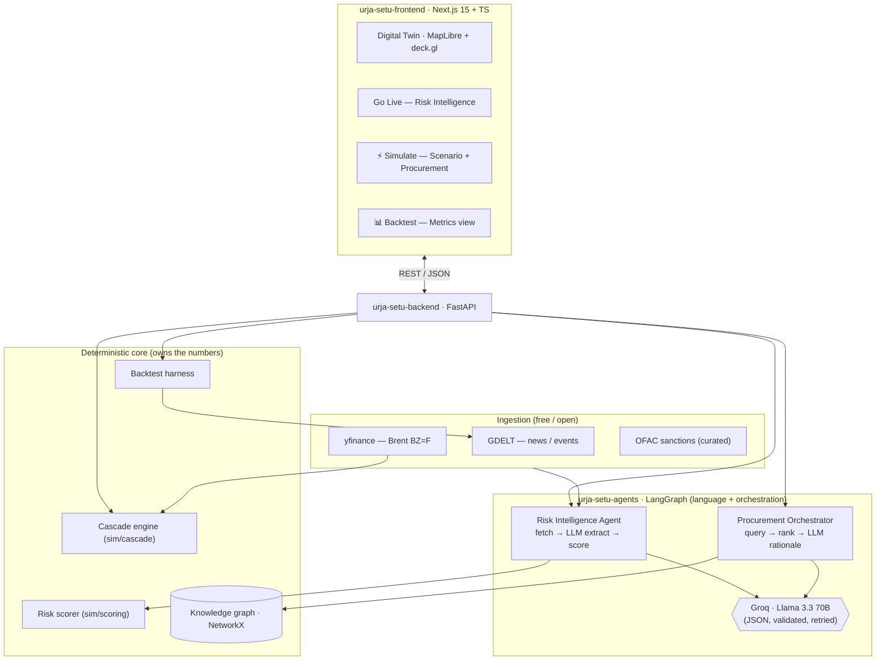

# URJA-SETU — Architecture

> AI-Driven Energy Supply Chain Resilience · ET AI Hackathon 2.0 (PoC)

## 1. One-line architecture
A real-time, agentic decision-support platform that fuses live geopolitical, commodity, and
sanctions signals into a **deterministic** risk + impact model over a **knowledge graph** of
India's crude supply network — proven on history with a backtest.

**Guiding principle:** *auditable math owns every number a judge sees; the LLM owns the words.*

## 2. System diagram

## 3. Components

### Frontend — `urja-setu-frontend/`
Next.js 15 (App Router) + TypeScript + Tailwind. A single-screen **war-room**: a MapLibre +
deck.gl digital twin of India's crude lifelines, with overlays driven by three actions —
**Go Live** (live risk), **⚡ Simulate** (scenario + procurement), **📊 Backtest** (metrics).

### Backend — `urja-setu-backend/urja_setu_backend/`
FastAPI gateway + the **deterministic core**:
- `sim/scoring.py` — fuses LLM event severity + price pressure + sanctions into the corridor
  disruption probability (cited weights).
- `sim/cascade.py` — scenario impact engine: supply gap → Brent impact → refinery run-rate →
  SPR cover, from explicit equations and editable assumptions.
- `kg/` — NetworkX knowledge graph (country–grade–supplier–route–chokepoint–refinery) powering
  procurement.
- `ingestion/` — GDELT, yfinance, sanctions (all free; cached + rate-limit-safe).
- `backtest/` — historical lead-time + precision/recall harness.

### Agents — `urja-setu-agents/`
LangGraph state machines. **Language and orchestration only — never the numbers.**
- **Risk Intelligence Agent**: `fetch → extract (LLM) → score (deterministic)`.
- **Procurement Orchestrator**: `query (KG) → rank (deterministic) → rationale (LLM)`.
- LLM = Groq Llama 3.3 70B with JSON-schema output, validation, retry; Ollama local fallback.

## 4. Key flows
| User action | Path | Output |
|---|---|---|
| **Go Live** | `GET /api/risk/live` → Risk Agent (GDELT + Brent + OFAC) | corridors scored from real signals, with cited headlines |
| **Simulate** | `POST /api/scenario/simulate` → cascade + Procurement Agent (KG) | supply gap / Brent / run-rate / SPR + ranked reroutes |
| **Backtest** | `GET /api/backtest` → harness (cached) | recall / precision / avg lead-time over historical events |

## 5. Why the numbers are trustworthy (rubric: "explicit & testable")
- The **cascade** and **scoring** are deterministic Python; every coefficient is named, sourced,
  and **editable in the UI** (re-simulate to test sensitivity).
- The **backtest** measures detection against curated real events on real GDELT attention data,
  reported against a no-early-warning baseline — not asserted, demonstrated.
- **Demo Mode** (seeded) + cached backtest make the demo reproducible offline; **Live Mode** runs
  on real feeds.

## 6. Stack (100% free / open-source)
Next.js · TypeScript · Tailwind · MapLibre GL · deck.gl · FastAPI · LangGraph · Groq (free) ·
NetworkX · NumPy · yfinance · GDELT · OFAC · (pgvector/Redis provisioned for scale).

## 7. Scalability path
Stateless gateway · modular agents (add commodities/countries by config) · NetworkX → Neo4j ·
single-node → queue + workers · GDELT → multi-source news + paid AIS at scale. Zero vendor lock-in.
